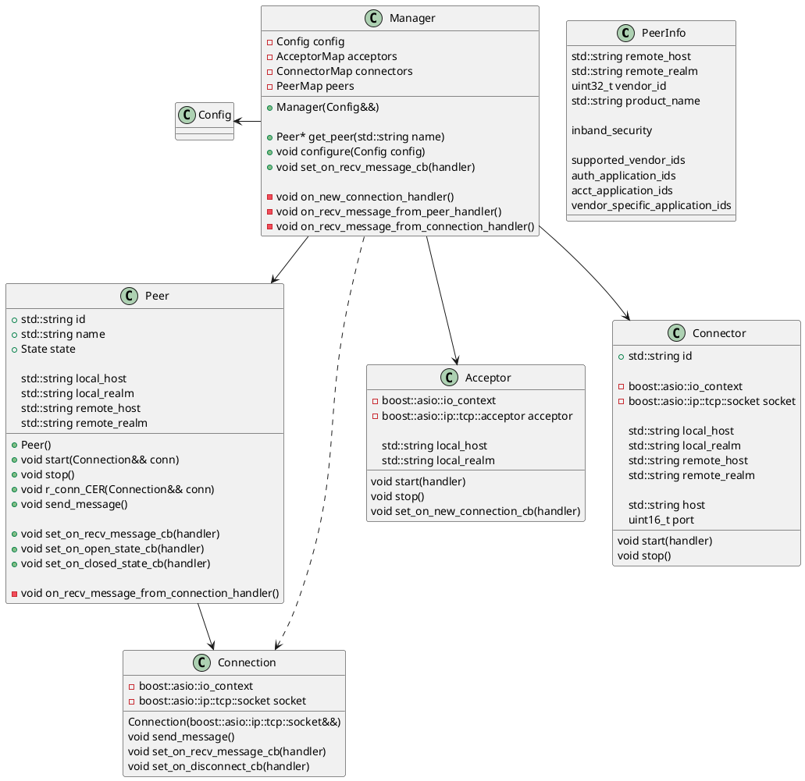

# Diameter

## Сlass diagram for Core

```plantuml
@startuml
Class PeerInfo {
  std::string remote_host
  std::string remote_realm
  uint32_t vendor_id
  std::string product_name

  inband_security

  supported_vendor_ids
  auth_application_ids
  acct_application_ids
  vendor_specific_application_ids
}

Class Peer {
  +std::string id
  +std::string name
  +State state

  std::string local_host
  std::string local_realm
  std::string remote_host
  std::string remote_realm

  +Peer()
  +void start(Connection&& conn)
  +void stop()
  +void r_conn_CER(Connection&& conn)
  +void send_message()

  +void set_on_recv_message_cb(handler)
  +void set_on_open_state_cb(handler)
  +void set_on_closed_state_cb(handler)

  -void on_recv_message_from_connection_handler()
}

Class Connection {
  -boost::asio::io_context
  -boost::asio::ip::tcp::socket socket

  Connection(boost::asio::ip::tcp::socket&&)
  void send_message()
  void set_on_recv_message_cb(handler)
  void set_on_disconnect_cb(handler)
}

Class Acceptor {
  -boost::asio::io_context
  -boost::asio::ip::tcp::acceptor acceptor

  std::string local_host
  std::string local_realm

  void start(handler)
  void stop()
  void set_on_new_connection_cb(handler)
}
Class Connector {
  +std::string id

  -boost::asio::io_context
  -boost::asio::ip::tcp::socket socket

  std::string local_host
  std::string local_realm
  std::string remote_host
  std::string remote_realm

  std::string host
  uint16_t port

  void start(handler)
  void stop()
}
Class Manager {
  -Config config
  -AcceptorMap acceptors
  -ConnectorMap connectors
  -PeerMap peers

  +Manager(Config&&)

  +Peer* get_peer(std::string name)
  +void configure(Config config)
  +void set_on_recv_message_cb(handler)

  -void on_new_connection_handler()
  -void on_recv_message_from_peer_handler()
  -void on_recv_message_from_connection_handler()
}

Peer-->Connection
Manager-->Acceptor
Manager-->Connector
Manager-->Peer
Manager..>Connection
Config<-Manager
@enduml
```
